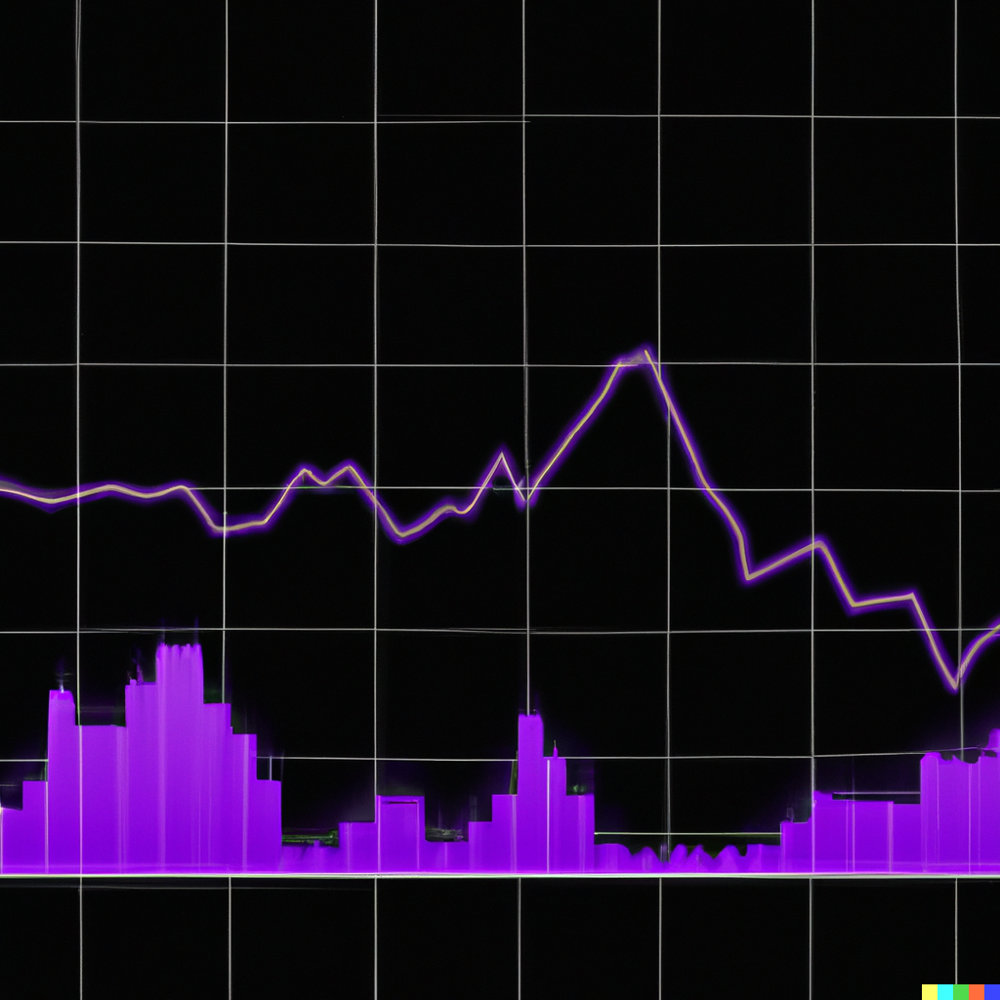

  

    
## Budget Buddy

This is a simple mobile application to help you track purchases and be more aware of your budget.

### Built With

This is a React Native application so it made sense to use Redux for state management. The frontend is styled using Tailwind thanks to the nativewind library.

* [![React][React.js]][React-url]
* [![Redux][Redux.com]][Redux-url]

[React.js]: https://img.shields.io/badge/React_Native-20232A?style=for-the-badge&logo=react&logoColor=61DAFB
[React-url]: https://reactjs.org/
[Redux.com]: https://img.shields.io/badge/Redux-764abc?style=for-the-badge&logo=redux&logoColor=FFF
[Redux-url]: https://redux.js.org/